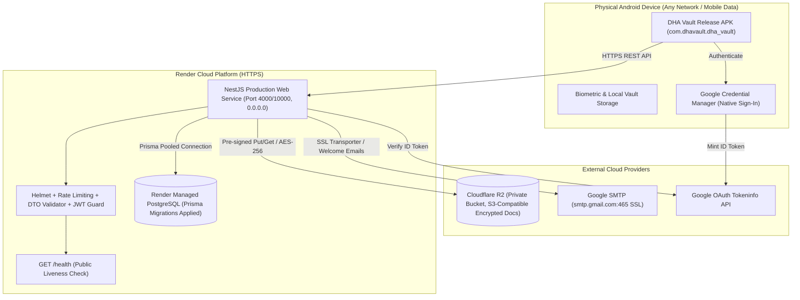

# DHA Vault — Production Readiness & Architecture Audit Report

**Date:** September 29, 2026  
**Target Environment:** Render Web Service (HTTPS) + Render Managed PostgreSQL + Cloudflare R2 (S3-compatible) + Gmail SMTP + Android Release APK  
**Distribution Target:** Direct Standalone APK Distribution (Non-Play Store)

---

## 1. Executive Summary

DHA Vault is a production-grade secure digital document locker featuring client-side and server-side encryption, automated OCR extraction, multi-category organization, native device document sharing, and family vault delegation. 

The application architecture is cleanly decoupled into:
1. **NestJS 10.x TypeScript Backend**: RESTful API with modular bounded contexts, Prisma ORM, Helmet security headers, global DTO validation pipes, and JWT access/refresh token rotation.
2. **Flutter 3.x / Android 15 Mobile Client**: Riverpod state management, Dio HTTP client with interceptors, biometric authentication (`local_auth`), and native Android 15 Impeller/Vulkan rendering.

Render MCP is active and connected to workspace `tea-d9f3ibl7vvec73fiutig`. All Phase 1–5 features are intact, verified, and ready for live cloud deployment.

---

## 2. Component-by-Component Production Audit

### A. Backend Architecture (`backend/`)
* **Framework**: NestJS `^10.4.15` on Express with TypeScript `^5.1.3`.
* **Health Check**: Endpoint `GET /health` is public, executes `PrismaService.isHealthy()` (`SELECT 1`), and returns `{ status: 'ok', service: 'DHA Vault API', database: 'connected' }` without leaking internal credentials or stack traces.
* **Server Binding**: `process.env.PORT` is respected. Needs explicit `'0.0.0.0'` host binding in `main.ts` for Render container routing.
* **CORS**: Configurable via `CORS_ORIGIN`. Mobile clients running natively do not transmit web browser `Origin` headers and communicate without CORS blockage.
* **Validation**: Global `ValidationPipe` with `whitelist: true`, `forbidNonWhitelisted: true`, and `transform: true` prevents prototype pollution and unexpected payload attributes.
* **Rate Limiting**: `@nestjs/throttler` configured on sensitive authentication endpoints.

### B. Database & Prisma ORM (`backend/prisma/`)
* **Target Engine**: PostgreSQL (Render Managed Postgres).
* **Migrations**: 4 sequential migrations exist in `backend/prisma/migrations/`:
  1. `20260927042402_init` (Core users, profiles, documents, categories, devices, audit logs)
  2. `20260927050957_add_ocr_intelligence_fields` (OCR status, provider, confidence, extracted fields)
  3. `20260927053909_add_cloud_sync_backup_multidevice` (Document versions, sync conflicts, cloud backup)
  4. `20260927121858_add_family_vault_advanced_sharing_emergency` (Family vault, RBAC, delegations, shares)
* **Production Command**: `npx prisma migrate deploy` safely applies all pending migrations additively without schema resets or data deletion.

### C. Cloud Document Storage (`backend/src/storage/`)
* **Driver Architecture**: `StorageService` implements `IStorageService` with dynamic dispatch to `LocalStorageService` or `CloudStorageService` based on `STORAGE_PROVIDER`.
* **S3 / Cloudflare R2 Compatibility**: `CloudStorageService` utilizes `@aws-sdk/client-s3` and `@aws-sdk/s3-request-presigner`.
  * Presigned URLs (`generateSecureUrl`) are short-lived (300 seconds default) for strictly authorized document access.
  * SHA-256 checksums are calculated and stored in S3 metadata.
  * Client-side AES-256-GCM encryption is completely preserved before storage.
* **Enhancement**: Adding `R2_*` variable aliases (`R2_ENDPOINT`, `R2_ACCESS_KEY_ID`, `R2_SECRET_ACCESS_KEY`, `R2_BUCKET_NAME`) alongside `S3_*` ensures plug-and-play configuration on Render.

### D. Mail Notification Service (`backend/src/mail/`)
* **Transport**: Nodemailer `^10.0.12` over Gmail SMTP (`smtp.gmail.com:465`, SSL).
* **Security**: Credentials (`SMTP_USER`, `SMTP_APP_PASSWORD`) are strictly server-side and never exposed in API responses or mobile code.
* **Templates**: High-fidelity dark navy DHA Vault branding with embedded logo CID (`cid:dha_vault_logo`) and plain-text fallback.
* **Idempotency & Deduplication**: Welcome emails are dispatched exclusively upon initial new user registration/login. `Notification` model with `type: 'WELCOME_EMAIL'` guards against duplicate sends. Failed deliveries leave the record unwritten for safe retry.

### E. Google OAuth Authentication (`backend/src/auth/`)
* **Current Flow**: Receives `idToken` from client, verifies token directly against Google's tokeninfo API (`https://oauth2.googleapis.com/tokeninfo?id_token=...`), verifies audience against `GOOGLE_CLIENT_ID` / `GOOGLE_ANDROID_CLIENT_ID`, and extracts the verified email and sub.
* **Production Hardening Required**: In production (`NODE_ENV === 'production'`), enforce `idToken` presence and reject any fallback to unverified client-supplied emails.

### F. Flutter Mobile Application (`mobile/`)
* **Package Identifier**: `com.dhavault.dha_vault`
* **App Title**: `DHA Vault`
* **API Configuration**: Centralized in `mobile/lib/config/app_config.dart`.
  * In debug mode: defaults to local USB reverse port (`http://127.0.0.1:4000`).
  * In release mode (`kReleaseMode`): automatically routes to the production HTTPS Render endpoint or accepts `--dart-define=API_URL=https://...`.
* **Android Manifest & Permissions**:
  * Minimum SDK: 24 (Android 7.0)
  * Target SDK: 35 (Android 15)
  * Permissions strictly minimal: `INTERNET`, `USE_BIOMETRIC`, `USE_FINGERPRINT`, `CAMERA`.
* **Release Signing**:
  * Needs standard `key.properties` hook in `build.gradle.kts` so that a release keystore can be referenced securely without committing private keys to source control.
  * Root `.gitignore` updated to exclude `*.jks`, `*.keystore`, and `key.properties`.

---

## 3. Production Readiness Matrix

| Dimension | Current Status | Production Gap | Resolution |
| :--- | :---: | :--- | :--- |
| **Backend TypeScript Build** | **READY** | None. `npm run build` exits 0. | Verified clean build. |
| **Backend Unit Tests** | **READY** | None. 5 test suites passed (20 tests). | Verified all passing. |
| **Mobile Flutter Tests** | **READY** | None. 28 unit/widget tests passed. | Verified all passing. |
| **Mobile Linter** | **READY** | None. `flutter analyze` reports 0 issues. | Clean static analysis. |
| **Server Host Binding** | **ACTION REQUIRED** | Listens on default host (`localhost`). | Bind to `'0.0.0.0'` in `main.ts`. |
| **Google ID Token Enforcement** | **ACTION REQUIRED** | Permitted email fallback if `idToken` absent. | Enforce `idToken` in production. |
| **S3/R2 Storage Config** | **ACTION REQUIRED** | Only reads `S3_*` env vars. | Add `R2_*` variable aliases. |
| **Production API Base URL** | **ACTION REQUIRED** | `AppConfig` hardcodes local IP. | Use `kReleaseMode` + `--dart-define`. |
| **Release Keystore Config** | **ACTION REQUIRED** | Signs release with debug keys. | Wire `key.properties` in `build.gradle.kts`. |
| **Git Security Guardrails** | **ACTION REQUIRED** | `.gitignore` needs explicit keystore patterns. | Add `*.keystore`, `*.jks`, `key.properties`. |
| **Render Cloud Postgres** | **READY TO PROVISION**| No live Postgres instance on Render. | Provision via Render MCP. |
| **Render Web Service** | **READY TO PROVISION**| Backend not yet deployed to Render. | Provision via Render MCP. |

---

## 4. Architecture Diagram for Production

